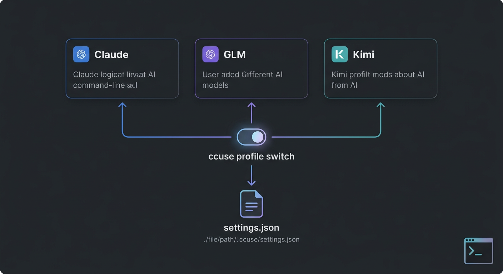

# ccuse

A profile switcher for [Claude Code](https://claude.ai/code) CLI. Easily switch between different API configurations.

## Quick Install

> **Copy this prompt and ask your Claude Code:**

```
Install ccuse by running:
curl -fsSL https://raw.githubusercontent.com/kevinten-ai/ccuse/main/ccuse -o ~/.local/bin/ccuse && chmod +x ~/.local/bin/ccuse && ccuse --help
```

## Supported Providers

| Provider | Command | API Source | Models |
|----------|---------|------------|--------|
| Claude (Native) | `ccuse claude` | Anthropic API | claude-opus-4-6, claude-sonnet-4-6, etc. |
| GLM | `ccuse glm` | [Zhipu AI](https://open.bigmodel.cn/) | GLM-5, GLM-4.7, GLM-4.7-FlashX |
| Kimi | `ccuse kimi` | [Moonshot AI](https://platform.moonshot.cn/) | kimi-k2.5, kimi-k2-turbo-preview |

## Installation

### One-Line Install (Recommended)

```bash
curl -fsSL https://raw.githubusercontent.com/kevinten-ai/ccuse/main/ccuse -o ~/.local/bin/ccuse && chmod +x ~/.local/bin/ccuse
```

### Install via Claude Code Skill

Tell Claude Code: *"Install ccuse skill"* or run:

```bash
# Read and follow the skill instructions
curl -fsSL https://raw.githubusercontent.com/kevinten-ai/ccuse/main/skill/SKILL.md
```

### Manual Install

```bash
# Clone and setup
git clone https://github.com/kevinten-ai/ccuse.git
cd ccuse
chmod +x ccuse

# Add to PATH (choose one)
ln -s $(pwd)/ccuse /usr/local/bin/ccuse  # System-wide
# OR
ln -s $(pwd)/ccuse ~/.local/bin/ccuse     # User-local
```

### Verify Installation

```bash
ccuse --help
```

## Quick Start



### Step 1: Save your current Claude settings

```bash
ccuse init-claude
```

This creates a backup of your current `settings.json` as the `claude` profile.

### Step 2: Create additional profiles

```bash
# Create GLM profile
ccuse init-glm

# Create Kimi profile
ccuse init-kimi
```

The init commands will:
1. Create a profile template in `~/.claude/profiles/`
2. Display instructions for getting your API key
3. **Automatically open the file for editing** (if an editor is available)

### Step 3: Set your API keys

After running init commands, the profile file will open automatically. Replace the placeholder:

```json
{
  "env": {
    "ANTHROPIC_AUTH_TOKEN": "YOUR_API_KEY_HERE",
    ...
  }
}
```

**Get your API keys from:**
- GLM: https://open.bigmodel.cn/
- Kimi: https://platform.moonshot.cn/

### Step 4: Switch profiles

```bash
ccuse glm     # Use GLM
ccuse kimi    # Use Kimi
ccuse claude  # Back to native Claude
```

## Commands

| Command | Description |
|---------|-------------|
| `ccuse claude` | Switch to native Claude profile |
| `ccuse glm` | Switch to GLM (Zhipu AI) profile |
| `ccuse kimi` | Switch to Kimi (Moonshot AI) profile |
| `ccuse init-claude` | Save current settings.json as claude profile |
| `ccuse init-glm` | Create or reconfigure a GLM profile |
| `ccuse init-kimi` | Create or reconfigure a Kimi profile |
| `ccuse list` | List all available profiles (shows active) |
| `ccuse show` | Show current Claude Code configuration |
| `ccuse edit <name>` | Edit a profile file |
| `ccuse remove <name>` | Remove a profile |
| `ccuse --help` | Show help message |

## Available Models

### GLM (Zhipu AI)

| Model | Description | Context |
|-------|-------------|---------|
| `GLM-5` | Latest flagship, coding aligned with Claude Opus 4.5 | 200K |
| `GLM-4.7` | High intelligence, better coding & aesthetics | 200K |
| `GLM-4.7-FlashX` | Lightweight, fast, cost-effective | 200K |

### Kimi (Moonshot AI)

| Model | Description | Context |
|-------|-------------|---------|
| `kimi-k2.5` | Latest, most intelligent, multimodal | 256K |
| `kimi-k2-0905-preview` | Enhanced agentic coding | 256K |
| `kimi-k2-turbo-preview` | High speed (60-100 tokens/s) | 256K |
| `moonshot-v1-8k/32k/128k` | Legacy text models | 8K-128K |

## How It Works

```
~/.claude/
├── settings.json      # Active configuration (what Claude Code reads)
├── settings.json.bak  # Automatic backup
└── profiles/
    ├── claude.json    # Native Claude profile
    ├── glm.json       # GLM profile
    └── kimi.json      # Kimi profile
```

When you run `ccuse <name>`:
1. Creates a backup of current `settings.json`
2. Copies the profile to `settings.json`
3. Claude Code uses the new configuration on next run

## Environment Variables

| Variable | Default | Description |
|----------|---------|-------------|
| `CLAUDE_DIR` | `~/.claude` | Base Claude config directory |
| `PROFILE_DIR` | `$CLAUDE_DIR/profiles` | Directory for profile files |
| `SETTINGS_FILE` | `$CLAUDE_DIR/settings.json` | Path to active settings |
| `BACKUP_SUFFIX` | `.bak` | Suffix for backup files |

## Adding Custom Profiles

You can create custom profiles for any Anthropic-compatible API:

1. Create a new JSON file in `~/.claude/profiles/`:

```bash
ccuse edit my-provider
```

2. Add your configuration:

```json
{
  "env": {
    "ANTHROPIC_AUTH_TOKEN": "your-api-key",
    "ANTHROPIC_BASE_URL": "https://your-api-endpoint/v1",
    "API_TIMEOUT_MS": "3000000",
    "CLAUDE_CODE_DISABLE_NONESSENTIAL_TRAFFIC": "1"
  }
}
```

3. Use it:

```bash
ccuse my-provider
```

## Troubleshooting

### Profile not found

```
Missing profile file: ~/.claude/profiles/glm.json
Run: ccuse init-glm
```

Run the init command as suggested to create the profile.

### Reconfiguring a profile

If you want to reset a profile to its default template:

```bash
ccuse init-glm
# Profile already exists: ~/.claude/profiles/glm.json
# Do you want to reconfigure it? [y/N] y
# Backup created: ~/.claude/profiles/glm.json.bak.20240313120000
```

The old profile is backed up with a timestamp before creating the new template.

### Removing a profile

```bash
ccuse remove glm
# Removing profile: glm
# Are you sure? [y/N] y
# Profile removed: glm
```

### API key errors

Make sure you've replaced `YOUR_ZHIPU_API_KEY` or `YOUR_KIMI_API_KEY` with your actual API key in the profile file.

### Editor not opening

The script uses these editors in order:
1. `$EDITOR` environment variable
2. VS Code (`code`)
3. `nano`

Set your preferred editor:
```bash
export EDITOR=vim  # or code, nano, etc.
```

## License

MIT
